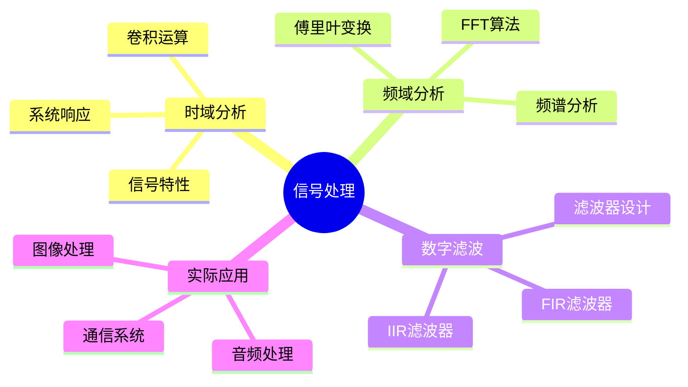

<!--
═══════════════════════════════════════════════════════════════════════════════
  🎨 GitHub 主页完整豪华版

  📝 自定义说明：
  1. 将所有的 "A1RER" 替换为你自己的 GitHub 用户名
  2. 修改个人介绍内容（第21-24行）
  3. 修改技能图标（第55行）- 在 https://skillicons.dev 查看所有可用图标
  4. 修改主题颜色（theme 参数）- 可选：dark, radical, merko, gruvbox, tokyonight, onedark, cobalt, synthwave, highcontrast, dracula 等
  5. 修改语言和文字描述
═══════════════════════════════════════════════════════════════════════════════
-->

<div align="center">

  <!-- 动态打字效果标题 - 可修改文字内容 -->
  

  <!-- 个人简介 - 可修改内容和图标 -->
  <h3>📚 2024级本科在读 | 电子信息工程/通信工程专业</h3>
  <h4>💡 专注于信号处理、数字通信和算法实现</h4>
  <h4>🎯 目标：成为优秀的数字工程师</h4>

  <!-- 社交链接区域 - 取消注释并添加你的链接 -->
  <!--
  <a href="https://你的个人网站"></a>
  <a href="mailto:你的邮箱"></a>
  <a href="https://blog.你的博客"></a>
  -->

  <br/>

  <!-- 访问量统计 - 可修改颜色(color参数) -->
  

</div>

<br/>

<!-- 波浪分隔线 -->


<br/>

## 🎯 关于我

```python
class A1RER:
    def __init__(self):
        self.name = "A1RER"
        self.role = "电子信息工程专业学生"
        self.year = "2024级"
        self.location = "中国 🇨🇳"

    def current_focus(self):
        return {
            "learning": ["信号与系统", "数字信号处理", "通信原理"],
            "practicing": ["Python 编程", "MATLAB 仿真", "算法实现"],
            "exploring": ["时域/频域分析", "FFT 算法", "数字滤波器设计"]
        }

    def future_goals(self):
        return [
            "📡 深入学习数字通信技术",
            "🤖 掌握信号处理算法",
            "💼 成为专业的数字工程师"
        ]

## 🛠️ 技术栈 & 工具

<div align="center">

  <!-- 技能图标 - 在 https://skillicons.dev 查看更多图标 -->
  <!-- 可修改的图标：python,matlab,c,cpp,java,js,git,github,vscode,linux,windows,docker 等 -->
  

  <br/><br/>

  <!-- 详细技能列表 - 可修改内容和图标 -->

  **编程语言**

  
  
  

  **工具 & 平台**

  
  
  
  

  **学习领域**

  
  
  

</div>

<br/>

<!-- 波浪分隔线 -->


<br/>

## 📊 GitHub 统计数据

<div align="center">

  <!-- GitHub Stats 卡片 - 可修改主题(theme)、隐藏项(hide)、显示图标(show_icons) -->
  <!-- 主题选项: dark, radical, merko, gruvbox, tokyonight, onedark, cobalt, synthwave, highcontrast, dracula -->
  

  <!-- 语言统计卡片 - 可修改主题、布局(layout)、隐藏的语言(hide) -->
  

</div>

<br/>

<div align="center">

  <!-- GitHub Streak Stats - 连续贡献统计 -->
  <!-- 可修改主题、隐藏边框 -->
  

</div>

<br/>

<div align="center">

  <!-- GitHub 活动图表 - 可修改颜色(color)、背景(bg_color)、主题(theme) -->
  

</div>

<br/>

<!-- 波浪分隔线 -->


<br/>

## 🏆 GitHub 成就奖杯

<div align="center">

  <!-- GitHub Trophy - 显示你的成就 -->
  <!-- 可修改主题(theme)、列数(column)、边距(margin-w, margin-h)、隐藏项(no-frame, no-bg) -->
  

</div>

<br/>

<!-- 波浪分隔线 -->


<br/>

## 📖 学习路线

<div align="center">

| 阶段 | 内容 | 状态 |
|:---:|:---|:---:|
| 🎯 **基础阶段** | Python 编程基础 | ✅ 进行中 |
| 🎯 **基础阶段** | MATLAB 信号处理工具箱 | ✅ 进行中 |
| 📡 **核心课程** | 信号与系统 | ✅ 学习中 |
| 📡 **核心课程** | 数字信号处理 | 📚 计划中 |
| 🔬 **实践项目** | 时域/频域分析实验 | ✅ 进行中 |
| 🔬 **实践项目** | FFT 算法实现 | 📚 计划中 |
| 🚀 **进阶学习** | 数字滤波器设计 | 📚 计划中 |
| 🚀 **进阶学习** | 通信系统仿真 | 📚 计划中 |

</div>

<br/>

<!-- 波浪分隔线 -->


<br/>

## 💡 最近在学什么？

<div align="center">



</div>

<br/>

<!-- 波浪分隔线 -->


<br/>

## 📫 联系方式

<div align="center">

<!-- 取消注释并修改为你的实际联系方式 -->
<!--
📧 Email: your.email@example.com
🌐 Website: https://yourwebsite.com
📝 Blog: https://yourblog.com
💼 LinkedIn: https://linkedin.com/in/yourprofile
-->

💬 欢迎通过 GitHub Issues 或 Discussions 与我交流！

</div>

<br/>

<!-- 波浪分隔线 -->


<br/>

<div align="center">

  ### 📈 持续更新中...

  

</div>

<!--
═══════════════════════════════════════════════════════════════════════════════
  🎨 装饰元素说明：

  1. 动态打字效果：修改 lines= 后面的文字内容
  2. 代码块个人介绍：修改 class 里的内容
  3. 技能图标：在 https://skillicons.dev 查看所有可用图标
  4. GitHub Stats：theme= 可改为 dark, radical, merko, gruvbox, tokyonight 等
  5. 学习路线表格：添加或删除行，修改状态图标
  6. Mermaid 思维导图：修改节点内容和结构
  7. 波浪分隔线：可替换为其他样式或删除
  8. 社交链接：取消注释并填入真实链接

  更多资源：
  - Shields.io badges: https://shields.io
  - GitHub Readme Stats: https://github.com/anuraghazra/github-readme-stats
  - Skill Icons: https://skillicons.dev
  - Typing SVG: https://github.com/DenverCoder1/readme-typing-svg
  - Capsule Render: https://github.com/kyechan99/capsule-render
═══════════════════════════════════════════════════════════════════════════════
-->
